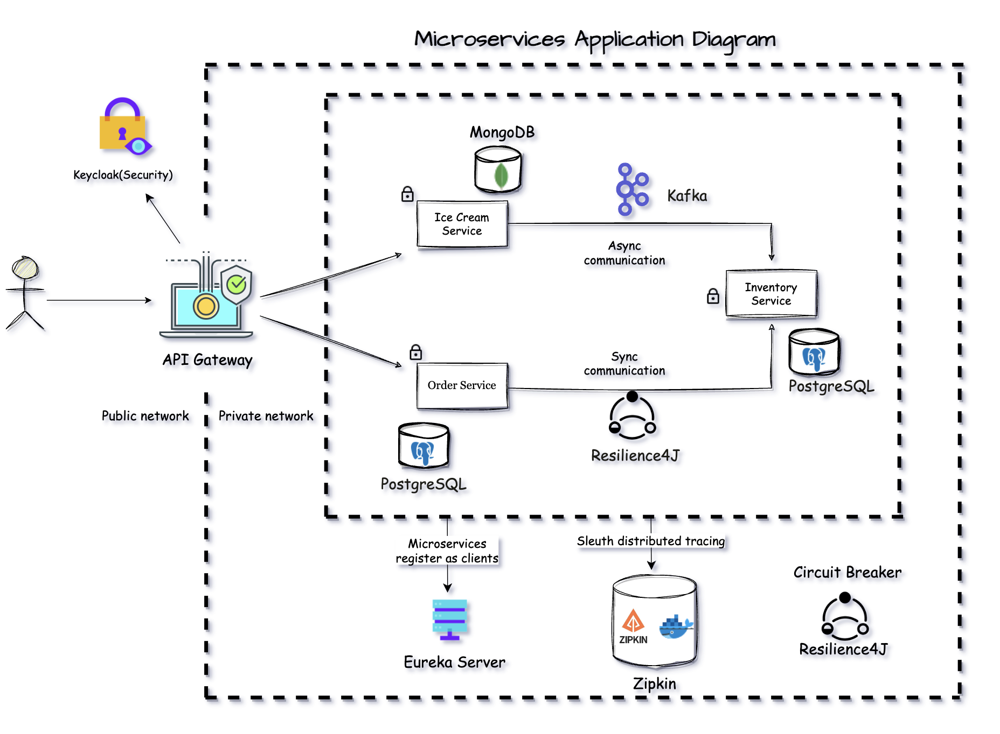

# Microservices Shopping Application

## Description
Developed a shopping application following a microservices architecture. Incorporated concepts like API gateway, service discovery, distributed tracing, and circuit breaking. 
Furthermore, the application uses synchronous and asynchronous styles of inter-process communication.

## Application Architecture
- Kafka: asynchronous interprocess communication.
- Resilience4J: circuit breaking.
- Zipkin: distributed tracing to track issues across microservices.
- Eureka Server(Service Discovery): register microservices as clients.
- Keycloak: application security.
- Backend: Java and Spring Boot.
- PostgreSQL(RDBMS): store data in a relational database.
- Docker: set up needed dependencies like PostgreSQL, Keycloak, etc...
- Prometheus: centralized microservices monitoring.
- Grafana: display monitoring data in an elegant and easy to understand format.

